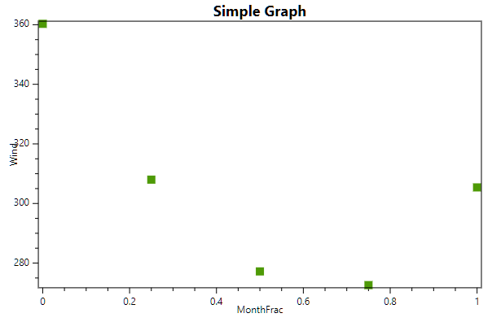

Tutorial to Scikit.ML.DataFrame
===============================

.. contents::
    :local:
    :depth: 1

DataFrame + GroupBy + Svg Plot
++++++++++++++++++++++++++++++

This example shows how to do a simple
groupby operation and to create a graph
based on the grouped data.

* `sln <DataFrameExample.sln>`_
* `source <GroupBy_Plot/Program.cs>`_

Output:

